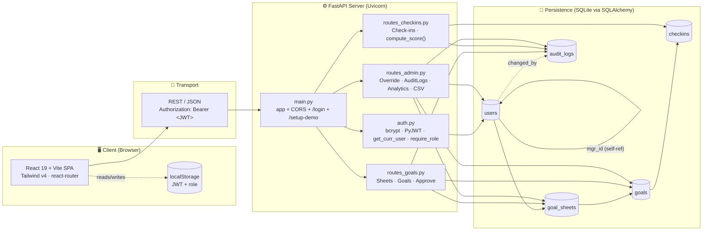
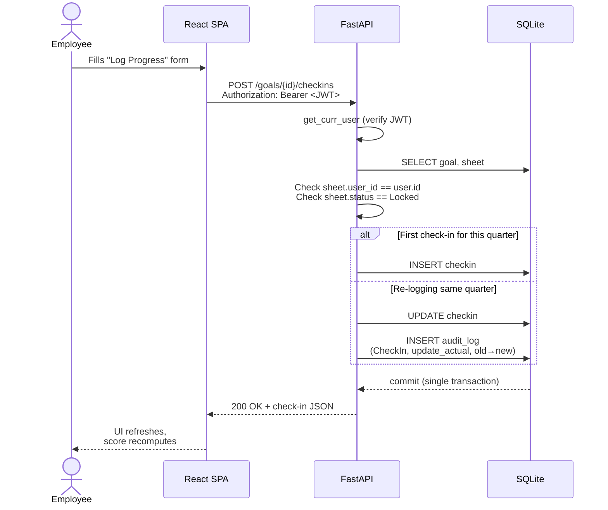

# AtomTracker — Hackathon Submission

> **In-House Goal Setting & Tracking Portal** — replaces fragile Excel sheets with strict 100% weight validation, automatic quarterly scoring, JWT-based RBAC, and a tamper-evident audit trail.

---

## 1. Live Working Link

| Component       | URL                                          |
| --------------- | -------------------------------------------- |
| **Frontend**    | `<https://your-frontend.vercel.app>`         |
| **Backend API** | `<https://your-backend.onrender.com>`        |
| **API Docs**    | `<https://your-backend.onrender.com/docs>`   |

### One-time setup (after first deploy)

Hit this URL in your browser to seed the three demo accounts:

```
<https://your-backend.onrender.com/setup-demo>
```

### Demo Login Credentials

> The login page also has **one-click "Demo Login"** buttons for each role.

| Role         | Email                  | Password   |
| ------------ | ---------------------- | ---------- |
| **Admin**    | `admin@test.com`       | `admin`    |
| **Manager**  | `manager@test.com`     | `manager`  |
| **Employee** | `employee@test.com`    | `employee` |

The Employee is already linked to the Manager via `mgr_id`, so the full approve → check-in → feedback flow works out of the box.

---

## 2. Source Code Repository

**GitHub:** `<https://github.com/your-username/atomtracker>`

Repo layout:

```
atomtracker/
├── backend/        # FastAPI + SQLAlchemy + SQLite
└── frontend/       # React + Vite + Tailwind v4
```

See [README.md](./README.md) for full local-setup instructions.

---

## 3. System Architecture

AtomTracker is a clean two-tier app: a stateless React SPA talking to a single FastAPI backend over JSON. Auth is handled with signed JWTs (HS256) carried in the `Authorization: Bearer` header on every request. The backend enforces role checks server-side regardless of what the client sends.



### Request lifecycle (example: an Employee logs Q1 progress)



### Key architectural decisions

| Decision | Why |
| -------- | --- |
| **JWT in `Authorization` header**, not cookies | Stateless server, trivial CORS, no CSRF surface |
| **Single generic `AuditLog` table** with `(entity_type, entity_id)` | One audit pattern across Goals/Sheets/Check-ins; easy to extend to new entities without migrations |
| **Audit writes share the transaction** of the change | Either both persist or neither does — no orphan logs, no missing logs |
| **Upsert check-ins** keyed on `(goal_id, quarter)` | "Latest" is unambiguous; revisions still preserved in the audit trail |
| **Server re-validates everything** the client validates (weight = 100, role checks, ownership) | UI never bypasses business rules |
| **SQLite for the hackathon**, swappable via `DB_URL` env var | Zero-config now, Postgres-ready in one env-var change |

---

## Built With

FastAPI · SQLAlchemy 2 · PyJWT · bcrypt · React 19 · Vite 8 · Tailwind v4 · lucide-react · react-router-dom v7
