# AtomTracker — Hackathon Submission

> **In-House Goal Setting & Tracking Portal** — replaces fragile Excel sheets with strict 100% weight validation, automatic quarterly scoring, JWT-based RBAC, a tamper-evident audit trail, and a built-in manager ↔ employee feedback channel.

---

## 1. Live Working Link

| Component       | URL                                                |
| --------------- | -------------------------------------------------- |
| **Frontend**    | https://atom-tracker-rust.vercel.app               |
| **Backend API** | https://atomtracker.onrender.com                   |
| **API Docs**    | https://atomtracker.onrender.com/docs              |

> ⚠️ **First request may take ~30 seconds.** The backend is hosted on Render's free tier, which sleeps after inactivity. The app shows a "Setting up demo accounts…" banner and automatically waits — just leave the page open and it will unlock on its own.

### Demo Login Credentials

> The login page has **one-click demo login buttons** for each role. Demo data is **automatically seeded** on every page load — no manual setup required.

| Role | Email | Password | What's pre-loaded |
| ---- | ----- | -------- | ----------------- |
| **Admin / HR** | `admin@test.com` | `admin` | Full org view — analytics, audit trail, cascade tool |
| **Manager** | `manager@test.com` | `manager` | 2 direct reports, team score chart |
| **Employee (Rahul)** | `employee@test.com` | `employee` | FY2026 sheet Locked + Q1 & Q2 check-ins done |
| **Employee (Sneha)** | `sneha@test.com` | `employee2` | FY2026 sheet Submitted — awaiting manager review |

All four accounts are linked: Rahul and Sneha both report to Manager; Manager and Admin share the same org. The full **Draft → Submit → Review → Approve → Check-in** workflow can be demonstrated end-to-end without creating any data manually.

---

## 2. Source Code Repository

**GitHub:** https://github.com/dharmendra26-wiz/AtomTracker

Repo layout:

```
atomtracker/
├── backend/        # FastAPI + SQLAlchemy + SQLite
└── frontend/       # React + Vite + Tailwind v4
```

See [README.md](./README.md) for full local-setup instructions.

---

## 3. System Architecture

AtomTracker is a clean two-tier app: a stateless React SPA talking to a single FastAPI backend over JSON. Auth is handled with signed JWTs (HS256) carried in the `Authorization: Bearer` header on every request. The backend enforces role checks server-side regardless of what the client sends.

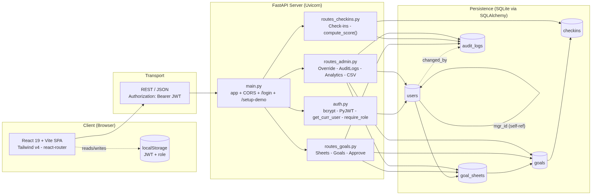

### Request lifecycle (example: an Employee logs Q1 progress)

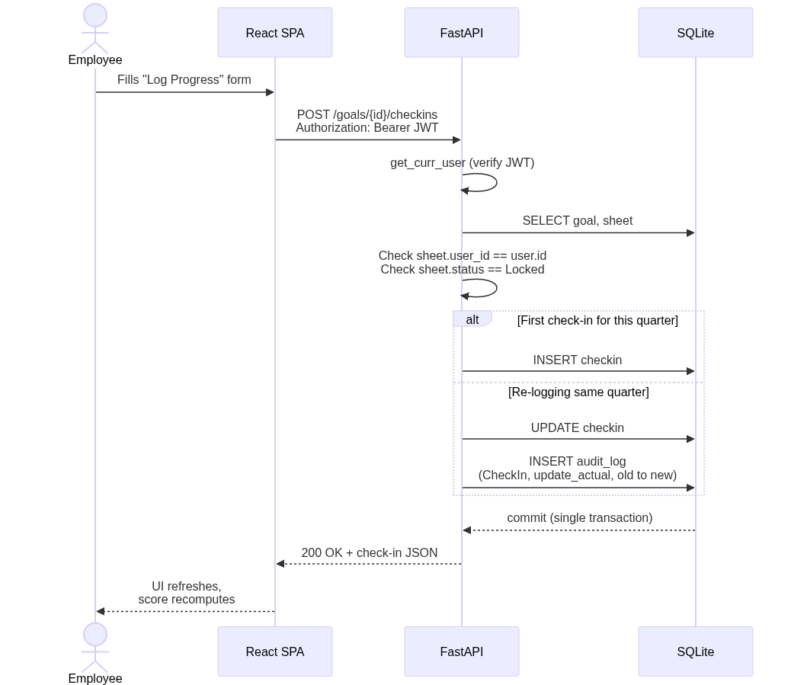

### Key architectural decisions

| Decision | Why |
| -------- | --- |
| **JWT in `Authorization` header**, not cookies | Stateless server, trivial CORS, no CSRF surface |
| **`sessionStorage` for auth state** | Session cleared on tab close — fresh login on every visit, no stale state |
| **Single generic `AuditLog` table** with `(entity_type, entity_id)` | One audit pattern across Goals/Sheets/Check-ins; easy to extend without migrations |
| **Audit writes share the transaction** of the change | Either both persist or neither does — no orphan logs |
| **Shared Goals via `source_goal_id` self-FK on `Goal`** | One row of truth for actuals — copies proxy the primary's check-ins so cascaded KPIs stay consistent |
| **`SheetComment` table for feedback threads** | Keeps all manager ↔ employee conversation in one place per sheet, replacing email/Slack sidechannels |
| **Server re-validates everything** the client validates | UI never bypasses business rules |
| **SQLite for the hackathon**, swappable via `DB_URL` env var | Zero-config now, Postgres-ready in one env-var change |

### Feature coverage vs. the problem statement

| BRD requirement | Status | Endpoint(s) |
| --- | --- | --- |
| Three roles (Employee / Manager / Admin) with RBAC | ✅ | `auth.require_role` |
| Up to 8 goals per sheet, min weight 10, total = 100 | ✅ | `POST /sheets/{id}/goals`, `POST /sheets/{id}/submit` |
| Manager approves and locks the sheet | ✅ | `POST /sheets/{id}/approve` |
| Manager returns sheet for rework with a comment | ✅ | `POST /sheets/{id}/reject` |
| Manager inline edits target/weight pre-approval | ✅ | `POST /goals/{id}/override` |
| Quarterly check-ins with auto-computed scores per UoM | ✅ | `POST /goals/{id}/checkins`, `GET /sheets/{id}/progress` |
| **Manager ↔ Employee feedback thread per sheet** | ✅ | `GET /sheets/{id}/comments`, `POST /sheets/{id}/comments` |
| Shared / cascaded goals (weight-only edit, actuals sync) | ✅ | `POST /goals/{id}/cascade` |
| Admin override of locked goals with audit trail | ✅ | `POST /goals/{id}/override` |
| Completion dashboard (per-employee × quarter matrix) | ✅ | `GET /completion` |
| Full audit trail explorer (per entity + system-wide feed) | ✅ | `GET /audit-logs`, `GET /audit-logs/{entity_id}` |
| Achievement CSV report | ✅ | `GET /reports/achievements.csv` |
| Org analytics (users by role, sheets by status, QoQ scores) | ✅ | `GET /analytics`, `GET /analytics/qoq` |

### UX Enhancements

| Feature | Description |
| ------- | ----------- |
| **Role-based onboarding tour** | 6-step guided modal on first login per role — walks the user through every feature |
| **Pre-seeded demo data** | 4 demo accounts with real goals, locked sheets, and Q1+Q2 check-ins ready on page load |
| **Auto-logout on stale session** | If the backend DB resets (free-tier cold start), the app detects the stale JWT and redirects to login automatically |
| **Server warm-up UX** | Login page shows a progress banner and keeps buttons disabled until the backend is live and demo data is seeded |

---

## Built With

FastAPI · SQLAlchemy 2 · PyJWT · bcrypt · React 19 · Vite 8 · Tailwind v4 · lucide-react · recharts · react-router-dom v7

---

## 4. Live Demo Screenshots

All screenshots taken from the live production deployment at **https://atom-tracker-rust.vercel.app**

### 👤 Employee Role

**Dashboard** — KPI cards show total sheets, draft/submitted/locked counts at a glance.

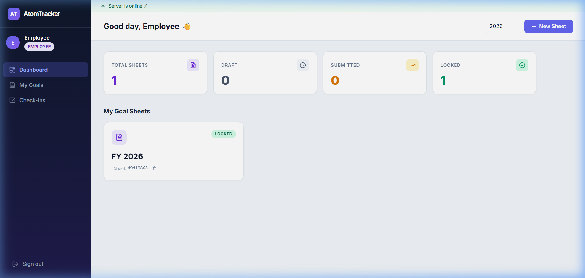

---

**New Sheet Created** — Employee created a FY 2027 goal sheet (Draft status).

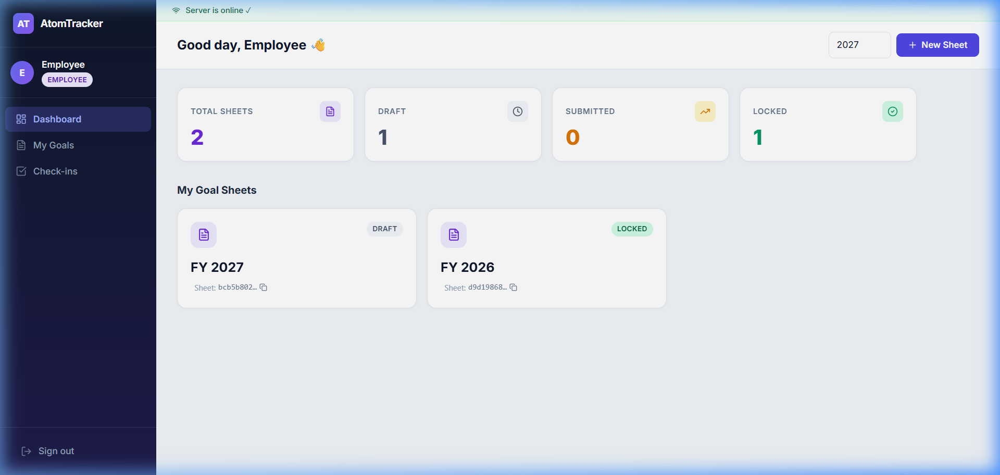

---

**Adding Goals** — Goal 1 "Increase Monthly Revenue by 20%" added (40% weight, UoM: Min, Target: 120). Weight bar shows 40/100.

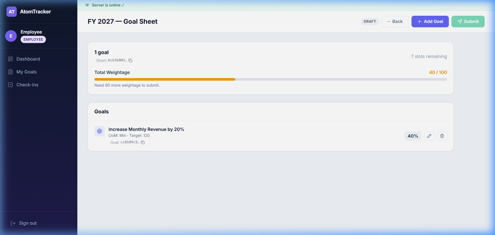

---

**Goal 2 Added** — "Reduce Customer TAT to under 48 hrs" (30% weight, UoM: Max). Weight bar at 70/100.

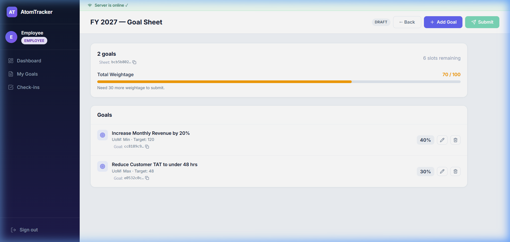

---

**All 3 Goals — Weight = 100/100** — "Zero Safety Incidents in FY2026" (30% weight, UoM: Zero) added. The green weight bar confirms exactly 100% — Submit button is now enabled.

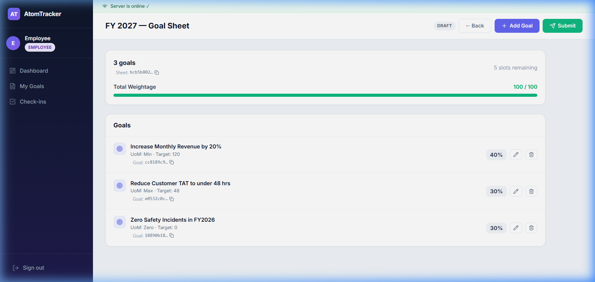

---

**Sheet Submitted** — Status changed to SUBMITTED. Sheet is now locked from editing and awaiting manager review.

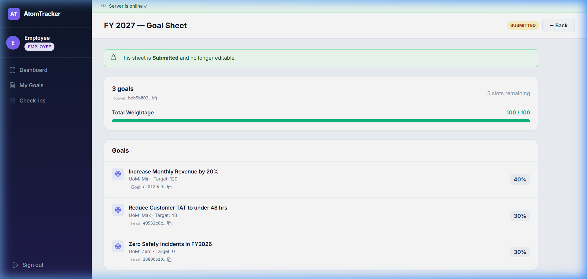

---

**Feedback Thread** — Employee and manager exchange messages directly on the goal sheet. Chat bubbles are color-coded by role.

---

### 👥 Manager Role

**Manager Dashboard** — Shows team members' goal sheets, team achievement scores bar chart, and score summaries.

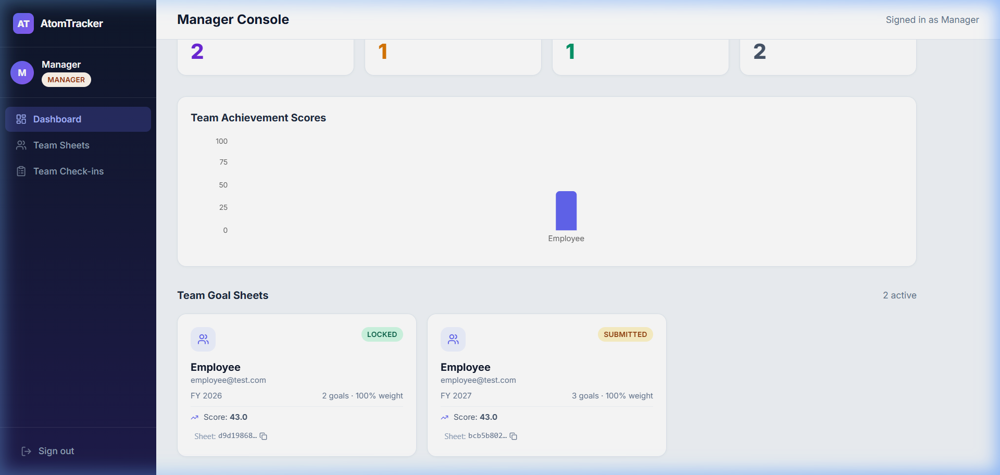

---

**Manager Review Page** — Manager sees the employee's goals in a structured table (Goal | UoM | Target | Weight) before deciding to approve or reject.

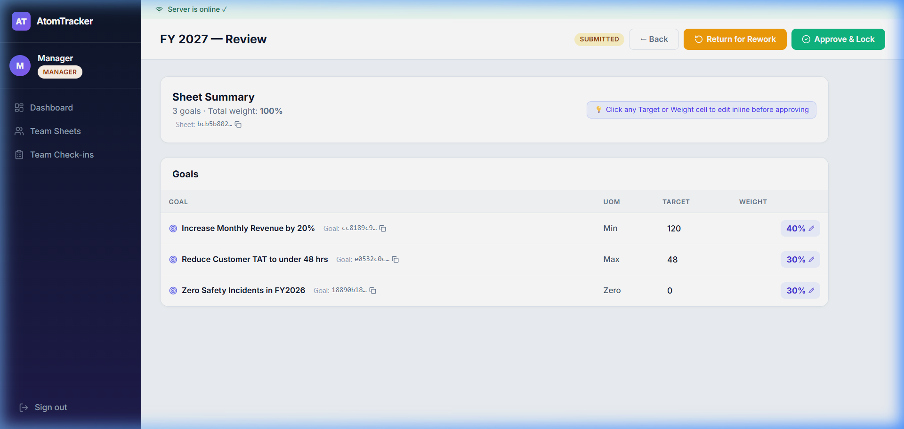

---

**Sheet Approved & Locked** — Manager clicked "Approve & Lock". Status changed to LOCKED (green badge). Goals are now frozen — quarterly check-ins can begin.

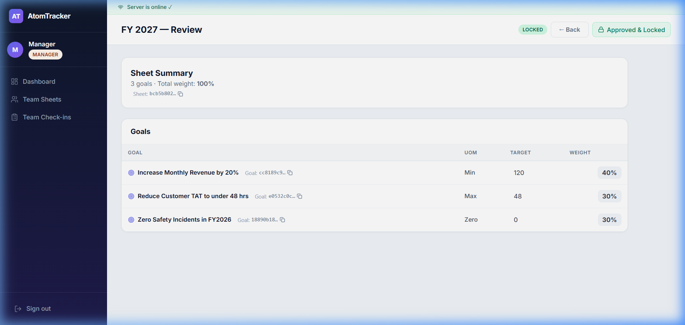

---

### 🛡️ Admin / HR Role

**Admin Console** — Full org-wide overview: users, sheets, goals. Includes Check-in Completion per quarter and Goal Cascade tool.

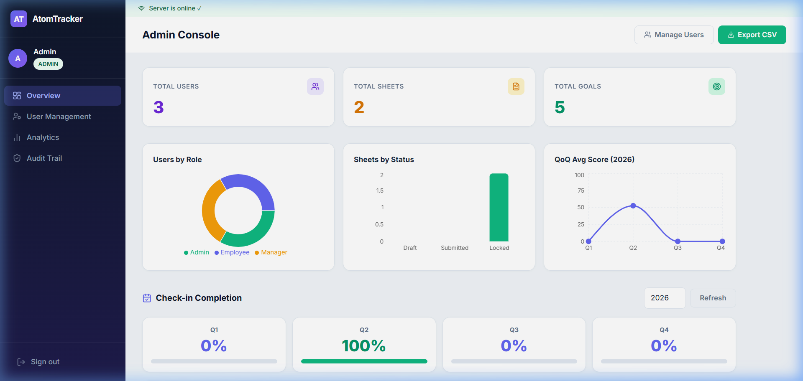

---

**Analytics** — Users by Role (donut), Sheets by Status (bar), and QoQ Average Score (line chart) — all on a dedicated Analytics page.

---

**Audit Trail** — Every approve, reject, override, cascade, and check-in is logged with timestamp, actor, and old→new values. Searchable by entity UUID.
